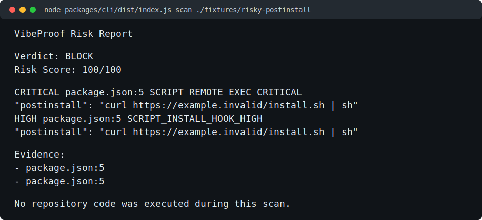

# VibeProof

[](https://github.com/gogun-rgb/vibeproof/actions/workflows/ci.yml)


**Scan before your AI runs it.**

VibeProof is a static preflight scanner for public GitHub repositories and local folders. It helps developers and AI coding agents spot risky install hooks, agent instructions, MCP permissions, container settings, direct dependencies, and secret-like text before running repository code.

VibeProof does not prove a repository is safe. It gives evidence-backed findings so a human reviewer can decide what to inspect next.

## Quick Start

After the npm package is published, use the CLI with `npx`:

```powershell
npx vibeproof scan https://github.com/owner/repository
```

Default scan mode is static and does not execute repository code.

## CLI Demo

The image below is rendered from actual CLI output produced by the risky postinstall fixture.



The fixture intentionally returns `BLOCK`, so the command exits with code `2`.

## CLI

```powershell
vibeproof scan <github-url-or-local-path>
vibeproof scan <target> --format terminal
vibeproof scan <target> --format json
vibeproof scan <target> --format markdown
vibeproof scan <target> --explain
vibeproof scan <target> --no-ai
vibeproof scan <target> --fail-on warn
vibeproof scan <target> --fail-on block
vibeproof rules list
vibeproof explain <rule-id>
```

Default scan mode is `--no-ai`. Static findings, score, and verdict are deterministic. Optional GPT explanation is separate from verified static findings and is disabled by default in v0.1.0.

Exit codes:

| Verdict | Default exit code |
| --- | --- |
| ALLOW | 0 |
| WARN | 1 |
| BLOCK | 2 |
| Internal or verifier error | 3 |

`--fail-on block` returns 0 for ALLOW and WARN, and 2 for BLOCK.

## What VibeProof Checks

- `package.json` lifecycle install hooks and remote execution patterns.
- README and AI-agent instruction files that ask agents to bypass safety.
- MCP configuration with broad filesystem or shell permissions.
- Docker and Compose settings such as privileged mode and Docker socket mounts.
- Secret-like text with masked evidence.
- Direct URL or Git dependencies.

Every finding includes:

- Rule ID
- Severity
- File path
- Line number
- Masked evidence
- Explanation
- Remediation
- Score contribution

## Architecture

```text
TARGET_VALIDATION
SOURCE_ACQUISITION
FILE_DISCOVERY
STATIC_SCAN
EVIDENCE_AGGREGATION
DETERMINISTIC_SCORING
GPT_SECURITY_REVIEW
CODE_VERIFICATION
REPORT_GENERATION
COMPLETED
FAILED
```

Monorepo layout:

```text
apps/web               Next.js App Router UI
packages/cli           CLI entrypoint and npm package
packages/core          Shared types and evidence helpers
packages/orchestrator  Scan state machine
packages/scanners      Static scanners and source discovery
packages/rules         Rule data
packages/verifier      Zod schema and evidence verification
packages/report        Terminal, JSON, and Markdown output
packages/ai-providers  Optional GPT review boundary
fixtures               Safe and risky test fixtures
```

## Web UI

```powershell
npm run dev -w @vibeproof/web
```

Open `http://localhost:3000`.

The web UI accepts public `https://github.com/owner/repo` URLs, calls the same scan engine, shows progress stages, renders findings and evidence, and downloads JSON or Markdown reports. It does not accept arbitrary server-local paths.

## Development

Clone the repository only when you want to build or contribute locally:

```powershell
git clone https://github.com/gogun-rgb/vibeproof.git
cd vibeproof
npm install
npm run build
npm run scan -- ./fixtures/risky-postinstall
```

Run focused tests while developing. Before release approval, run:

```powershell
npm run verify
```

GitHub Actions runs the same core checks on Windows, Ubuntu, and macOS.

## Security Boundaries

- VibeProof does not execute target repository code during default scans.
- VibeProof does not run target `npm install`, `pip install`, setup, build, or test commands.
- API keys are server-side only.
- Secret-like evidence is masked.
- GPT does not decide scores or verdicts.
- VibeProof does not guarantee safety; it reports static evidence.

## Environment

Copy `.env.example` when optional providers are needed.

```text
OPENAI_API_KEY=
GITHUB_TOKEN=
```

The CLI and core scanner work without API keys.
